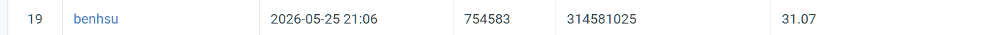

# NYCU_DLCV_Image_Restoration
Visual Recognition using Deep Learning 2026 Spring, Homework 4

Student Name: HSU, PAO-HUA
Student ID: 314581025

## Task
Train a **single** PromptIR model from scratch (no pretrained weights, no external data)
to restore degraded images for both **Rain** and **Snow** degradations.
Evaluation metric: **PSNR**. Submission: `pred.npz` with `uint8` arrays of shape `(3, H, W)`
keyed by original filename (e.g. `'0.png'`).

Reference: Potlapalli, V., Zamir, S. W., Khan, S. H., & Khan, F. S.
*PromptIR: Prompting for All-in-One Image Restoration.* NeurIPS 2023.
Official repo: https://github.com/va1shn9v/PromptIR (MIT License).

## Create uv env
If you clone this repo (with `uv.lock` and `pyproject.toml`), just run:
```bash
uv sync
```

Otherwise, to set up from scratch:
```bash
uv init --bare --python 3.11
uv add numpy pandas gdown
uv add torch torchvision pillow einops tqdm scikit-image wandb
```

## Download data
```bash
uv run gdown https://drive.google.com/file/d/1bEIU9TZVQa-AF_z6JkOKaGp4wYGnqQ8w/view?usp=drive_link
uv run unzip hw4_realse_dataset.zip
```

Expected dataset layout:
```
hw4_realse_dataset/
├── train/
│   ├── degraded/   # rain-{1..1600}.png, snow-{1..1600}.png
│   └── clean/      # rain_clean-{1..1600}.png, snow_clean-{1..1600}.png
└── test/
    └── degraded/   # 0.png ... 99.png  (rain/snow mixed, no type label)
```

## Project layout
```
src/
├── models/promptir.py    # PromptIR model (ported from official repo)
├── data/dataset.py       # PairedRestoreDataset + train/val split builder
├── utils/metrics.py      # PSNR
├── train.py              # training loop + wandb + auto-inference
└── infer.py              # standalone inference -> pred.npz
checkpoints/              # best.pth / last.pth saved here during training
```

## Train
First time only — log in to Weights & Biases:
```bash
uv run wandb login
```

Run training (defaults: 150 epochs, AdamW lr=2e-4, cosine schedule, L1 loss,
patch 128, val = last 100 images per degradation type). Adjust any flag as needed,
and set `--wandb_run_name` / `--wandb_notes` to label & annotate the run on wandb:
```bash
  uv run python -m src.train \
  --data_root hw4_realse_dataset \
  --epochs 200 \
  --batch_size 8 \
  --patch_size 128 \
  --lr 2e-4 \
  --num_workers 8 \
  --use_se --use_fft --use_gated \
  --char --ssim_w 0.2 --freq_w 0.05 \
  --use_ema --ema_decay 0.999 \
  --tta \
  --wandb_project NYCU_DLCV_HW4 \
  --wandb_run_name promptir_round2_full \
  --infer_name pred_round2.npz
  
```

What the training script does:
- Logs `train/loss` (per step), `val/psnr`, `lr`, and sample `(degraded | pred | clean)`
  panels to wandb each epoch.
- Saves `checkpoints/last.pth` every epoch and updates `checkpoints/best.pth` whenever
  validation PSNR improves.
- **After the last epoch, automatically loads `best.pth` and runs inference on the test
  set, writing `pred.npz` and uploading it as a wandb artifact.**

## Inference only
If you only want to regenerate `pred.npz` from a saved checkpoint:
```bash
uv run python -m src.infer --ckpt checkpoints/best.pth \
  --test_dir hw4_realse_dataset/test/degraded \
  --out pred.npz
```

## Verify the submission file
```bash
uv run python -c "
import numpy as np
d = np.load('pred.npz')
print('num images:', len(d.files))
print('first key :', d.files[0])
print('shape     :', d[d.files[0]].shape)
print('dtype     :', d[d.files[0]].dtype)
"
```
Expected: `100`, key like `'0.png'`, shape `(3, 256, 256)`, dtype `uint8`.

## Model details
- Architecture: PromptIR (Restormer backbone + prompt blocks in the decoder).
- Params: ~35.6 M.
- Trained from scratch on the provided 3200 paired images (1500 train + 100 val per type).
- Loss: L1. Optimizer: AdamW (lr=2e-4, wd=1e-4). Scheduler: CosineAnnealingLR to 1e-6.
- Data augmentation: random 128×128 crop, horizontal/vertical flip, random 90° rotation.
- Validation is performed on full 256×256 images (no cropping).


## Performance Snapshot
